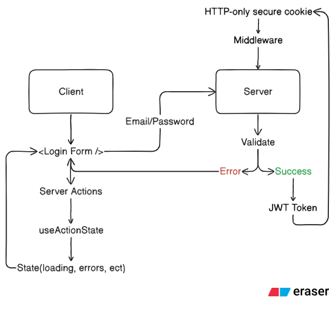

# Next.js Code Convention – Full Guidelines

## 1. Folder Structure
Ví dụ cấu trúc khuyến nghị:

```
src/
│
├── app/
│   ├── (auth)/                  # Layout riêng cho các trang auth (optional)
│   │   ├── login/
│   │   │   └── page.tsx
│   │   ├── register/
│   │   │   └── page.tsx
│   │   └── reset-password/
│   │       └── page.tsx
│   │
│   ├── dashboard/
│   │   ├── page.tsx
│   │   └── layout.tsx           # Middleware bảo vệ route
│   │
│   ├── api/
│   │   ├── auth/
│   │   │   ├── login/
│   │   │   │   └── route.ts     # POST /api/auth/login
│   │   │   ├── register/
│   │   │   │   └── route.ts     # POST /api/auth/register
│   │   │   ├── logout/
│   │   │   │   └── route.ts     # POST /api/auth/logout
│   │   │   ├── refresh/
│   │   │   │   └── route.ts     # GET /api/auth/refresh-token
│   │   │   └── me/
│   │   │       └── route.ts     # GET /api/auth/me
│   │   │
│   │   └── users/
│   │       └── route.ts         # API user info, roles …
│   │
│   └── layout.tsx
│
├── lib/
│   ├── auth/
│   │   ├── auth.service.ts      # Đăng nhập, đăng ký, hashing…
│   │   ├── token.ts             # Tạo JWT, verify token, refresh logic
│   │   ├── password.ts          # Hash/check password
│   │   └── auth-guard.ts        # Middleware server bảo vệ route
│   │
│   ├── prisma.ts                # Prisma client (nếu dùng)
│   └── http.ts                  # axios instance (CSR)
│
├── middleware.ts                 # Middleware bắt token từ cookie
│
├── utils/
│   ├── regex/
│   │   ├── username.ts
│   │   ├── password.ts
│   │   ├── email.ts
│   │   └── phone.ts
│   │
│   └── validators/
│       ├── auth.schema.ts       # Zod/Yup schemas: login, register
│       └── user.schema.ts
│
├── components/
│   ├── forms/
│   │   ├── LoginForm.tsx
│   │   ├── RegisterForm.tsx
│   │   └── InputField.tsx
│   │
│   └── auth/
│       ├── ProtectedRoute.tsx
│       └── ClientAuthProvider.tsx
│
└── types/
    ├── auth.d.ts
    └── user.d.ts

```

Convention chính
- Tách UI, logic, types, validators thành modules riêng.
- `app/` chỉ chứa route + layout + page (không chứa logic phức tạp).

---

## 2. Naming Conventions

### 2.1 Component
- PascalCase cho tên component và file trùng tên component.
- Ví dụ:
```text
components/common/Header.tsx
components/ui/InputField.tsx
```

### 2.2 Route folder
- Dùng lowercase cho folder route:
```text
app/auth/login
app/user/profile
```

### 2.3 Variables / Functions
- camelCase
- Boolean variables prefix bằng is/has/should/can:
```ts
const isLoading = true;
const fetchUser = () => {};
```

### 2.4 TypeScript Interface / Type
- PascalCase, không dùng tiền tố `I`.
```ts
type User = {
  id: string;
  name: string;
};
```

---

## 3. Separate Logic from UI
Không gọi trực tiếp fetch/logic trong page/component UI. Tách ra module trong `src/lib` hoặc `src/services`.

❌ Anti-pattern:
```ts
const res = await fetch("/api/login");
```

✔ Best practice:
```ts
// src/lib/api/auth.ts
export const login = async (data: LoginDTO) => { ... };

// trong page.tsx
const result = await login(formData);
```

---

## 4. UI/Component Code Style

### 4.1 No inline logic inside JSX
❌ Sai:
```tsx
<input onChange={(e) => setName(e.target.value)} />
```

✔ Đúng:
```tsx
const handleNameChange = (e) => setName(e.target.value);
<input onChange={handleNameChange} />
```

### 4.2 Component Structure
Cấu trúc component nên theo thứ tự rõ ràng:

```tsx
export default function LoginForm() {
  // 1. hooks

  // 2. handlers

  // 3. return UI
}
```

---

## 5. "use client" Rules
- Dùng `"use client"` khi component cần:
  - form
  - event handlers (click)
  - state: useState, useEffect, ...
- Không dùng `"use client"` cho:
  - layout chính
  - component chỉ render UI thuần (dùng server component khi được)

---

## 6. Validators (Regex, Zod, YUP)
Tạo folder validator:

```
src/lib/validators/
```

Ví dụ validator auth:
```ts
export const usernameRegex = /^[a-zA-Z0-9_]+$/;
export const phoneRegex = /^\d{10,15}$/;
export const emailRegex = /^[\w.-]+@[\w.-]+\.\w+$/;
```

Tách rõ validation để tái sử dụng.

---

## 7. API Fetching Convention

### 7.1 Server Component
Khi ở server component:
```ts
const user = await getUser();
```

### 7.2 Client Component
Tạo services để gọi API:
```ts
// src/services/auth.service.ts
export async function loginService(payload: LoginDTO) {
  return fetch("/api/auth/login", {
    method: "POST",
    body: JSON.stringify(payload),
  });
}
```

---

## 8. Tailwind CSS Convention

### 8.1 Class order
Sắp xếp từ chung → chi tiết:
```text
"w-full h-10 px-4 text-sm rounded-lg bg-white shadow"
```

### 8.2 Không viết class quá dài
- Nếu class quá dài: tạo component riêng hoặc class reuse.

Ví dụ globals.css:
```css
@layer components {
  .form-input {
    @apply w-full px-4 py-2 border rounded-xl;
  }
}
```

---

## 9. Layout & Page Rules

- `layout.tsx` chỉ chứa:
  - Header
  - Footer
  - Provider (ThemeProvider, AuthProvider, ...)
  - Container bọc UI
- `page.tsx` chỉ chứa UI của route, không chứa logic nặng (fetch/processing phức tạp nên đưa về server component / lib)

---

## 10. Import Ordering
Quy tắc 4 nhóm, theo thứ tự:

1. External libs
2. Components
3. Internal libs / utils / validators
4. Styles

Ví dụ:
```ts
// 1. External libs
import { useState } from "react";

// 2. Components
import Header from "@/components/common/Header";

// 3. Internal libs / utils / validators
import { usernameRegex } from "@/lib/validators/auth";

// 4. Styles
import "./styles.css";
```

## 11. Authentication Flow


---

## Ghi chú chung / Best Practices
- Giữ code rõ ràng, tách trách nhiệm (separation of concerns).
- Prefer server components cho nội dung tĩnh / fetch đơn giản.
- Tái sử dụng validators, constants, và hooks.
- Document rõ ràng các module public API (service, lib).
- Áp dụng code review checklist dựa trên các quy tắc trên.
